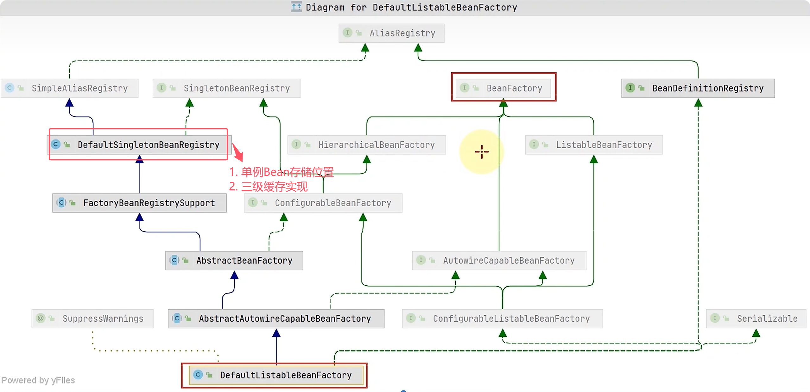
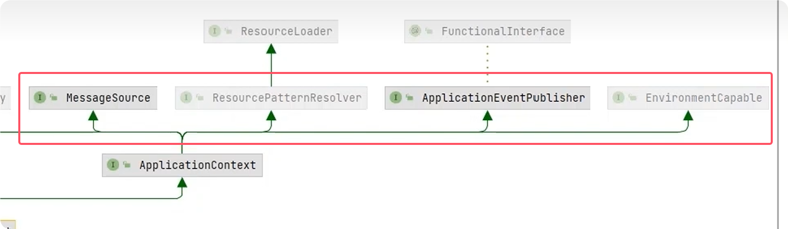

## 一、BeanFactory
### 1. 简介

***BeanFactory接口*** 定义了IOC容器的基本功能，控制反转、基本的依赖注入、直至 Bean 的生命周期的各种功能，都由它的实现类提供。

### 2. 核心实现类 - DefaultListableBeanFactory

`DefaultListableBeanFactory`是BeanFactory 接口体系的**完整实现类**，具备IOC容器的**基本功能：**
  - Bean存储管理、依赖注入实现、Bean生命周期管理、Bean查找和注册等IOC容器的基本功能；
  - 大部分 `ApplicationContext` 的实现类都组合了 `DefaultListableBeanFactory` 以实现IOC容器的相关功能。

其UML图如下：


:::details 示例：利用底层API手动组装IOC容器

1. 环境准备
```java
    @Configuration
    public static class Config {
        @Bean
        public Bean1 bean1(){
            return new Bean1();
        }
        @Bean
        public Bean2 bean2() {
            return new Bean2();
        }

    }

    public static class Bean1 {
        @Resource
        private Bean2 bean2;
        public Bean2 getBean2() {
            return bean2;
        }
    }

    public static class Bean2 {

    }
```


2. 最基础的IOC容器：
```java
public void main() {
        // 1. 创建Spring IOC容器（Bean工厂）
        DefaultListableBeanFactory beanFactory = new DefaultListableBeanFactory();

        // 2. 注册Bean
        AbstractBeanDefinition beanDefinition = BeanDefinitionBuilder.genericBeanDefinition(Config.class).getBeanDefinition();
        beanFactory.registerBeanDefinition("config", beanDefinition);

        // 3. 打印所有Bean
        Arrays.stream(beanFactory.getBeanDefinitionNames()).forEach(System.out::println);
    }
```

3. 添加Bean工厂后置处理器，支持处理@Configuration、@Bean等注解
```java
    public void main() { 
        // 1. 创建Spring IOC容器（Bean工厂）
        DefaultListableBeanFactory beanFactory = new DefaultListableBeanFactory();
        // 2. 注册Bean
        AbstractBeanDefinition beanDefinition = BeanDefinitionBuilder.genericBeanDefinition(Config.class).getBeanDefinition();
        beanFactory.registerBeanDefinition("config", beanDefinition);

        // 3. 给BeanFactory添加一些注解开发常用的的后处理器
        AnnotationConfigUtils.registerAnnotationConfigProcessors(beanFactory);
        // 4. 给BeanFactory注册IOC容器中的所有BeanFactory后处理器
        beanFactory.getBeansOfType(BeanFactoryPostProcessor.class).values().forEach(beanFactoryPostProcessor ->
                beanFactoryPostProcessor.postProcessBeanFactory(beanFactory)
        );
        System.out.println("---------------注册BeanFactory后处理器后-------------");
        Arrays.stream(beanFactory.getBeanDefinitionNames()).forEach(System.out::println);
        System.out.println("bean1依赖注入是否成功：" + beanFactory.getBean(Bean1.class).getBean2());
    }
```

4. 添加Bean后置处理器，支持处理@Autowired、@Resource等依赖注入注解
```java
    static void beanPostProcessor() {
        // 1. 创建Spring IOC容器（Bean工厂）
        DefaultListableBeanFactory beanFactory = new DefaultListableBeanFactory();
        // 2. 注册Bean
        AbstractBeanDefinition beanDefinition = BeanDefinitionBuilder.genericBeanDefinition(Config.class).getBeanDefinition();
        beanFactory.registerBeanDefinition("config", beanDefinition);

        // 3. 给BeanFactory添加一些注解开发常用的的后处理器
        AnnotationConfigUtils.registerAnnotationConfigProcessors(beanFactory);
        // 4. 给BeanFactory注册IOC容器中的所有BeanFactory后处理器
        beanFactory.getBeansOfType(BeanFactoryPostProcessor.class).values().forEach(beanFactoryPostProcessor ->
                beanFactoryPostProcessor.postProcessBeanFactory(beanFactory)
        );
        // 5. 为Bean注册Bean后处理器
        beanFactory.getBeansOfType(BeanPostProcessor.class).values().forEach(beanFactory::addBeanPostProcessor);
        System.out.println("---------------注册BeanFactory后处理器、Bean后处理器后-------------");
        Arrays.stream(beanFactory.getBeanDefinitionNames()).forEach(System.out::println);
        System.out.println("bean1依赖注入是否成功：" + beanFactory.getBean(Bean1.class).getBean2());
    }
```

:::
## 二、ApplicationContext

### 1. 概述
- `ApplicationContext`：其实现类组合并扩展了 BeanFactory 的功能，不仅如此，此接口还提供了国际化翻译、事件发布、资源加载、环境变量等功能，部分实现类如下：

    - 其UML图如下：
        

### 2. 实现类

:::details ClassPathXmlApplicationContext - 基于类路径 XML 配置

```java
    public static void main(String[] args) {
        ApplicationContext applicationContext = new ClassPathXmlApplicationContext("abc.xml");
        for (String beanDefinitionName : applicationContext.getBeanDefinitionNames()) {
            System.out.println(beanDefinitionName);
        }
    }
    static class Bean1 {
        private Bean2 bean2;
        // setter方法，xml文件依赖注入需要
        public void setBean2(Bean2 bean2) {
            this.bean2 = bean2;
        }
    }
    static class Bean2 {}
```

```xml
<?xml version="1.0" encoding="UTF-8"?>
<beans xmlns="http://www.springframework.org/schema/beans"
       xmlns:xsi="http://www.w3.org/2001/XMLSchema-instance"
       xsi:schemaLocation="http://www.springframework.org/schema/beans http://www.springframework.org/schema/beans/spring-beans.xsd">

    <bean id="bean1" class="com.summer.ioc.ApplicationContextDemo$Bean1">
        <property name="bean2" ref="bean2"></property>
    </bean>

    <bean id="bean2" class="com.summer.ioc.ApplicationContextDemo$Bean2"></bean>

</beans>
```
:::

:::details FileSystemXmlApplicationContext - 文件系统路径 XML 配置

```java
    public static void main(String[] args) {
        ApplicationContext applicationContext = new FileSystemXmlApplicationContext("D:\\java\\mycode\\spring-learning\\spring-thory\\src\\main\\resources\\abc.xml");
        // 也可以使用绝对路径，但是工作目录必须设置对(这里工作目录是spring-thory的父级目录)
        // ApplicationContext applicationContext = new FileSystemXmlApplicationContext("spring-thory\\src\\main\\resources\\abc.xml");
        for (String beanDefinitionName : applicationContext.getBeanDefinitionNames()) {
            System.out.println(beanDefinitionName);
        }
    }
```

:::

:::details AnnotationConfigApplicationContext - 基于注解配置

```java
    public static void main(String[] args) {
        AnnotationConfigApplicationContext applicationContext = new AnnotationConfigApplicationContext(Config.class);
        for (String beanDefinitionName : applicationContext.getBeanDefinitionNames()) {
            System.out.println(beanDefinitionName);
        }
    }
    @Configuration
    static class Config {
        @Bean
        public Bean1 bean1() {
            return new Bean1();
        }
        @Bean
        public Bean2 bean2() {
            return new Bean2();
        }
    }
```

打印：
```text
org.springframework.context.annotation.internalConfigurationAnnotationProcessor
org.springframework.context.annotation.internalAutowiredAnnotationProcessor
org.springframework.context.annotation.internalCommonAnnotationProcessor
org.springframework.context.event.internalEventListenerProcessor
org.springframework.context.event.internalEventListenerFactory
applicationContextDemo.Config
bean1
bean2
```
:::

:::details ApplicationContext -集成ServletWeb容器

```java
package com.summer.ioc;

import org.springframework.boot.autoconfigure.web.servlet.DispatcherServletRegistrationBean;
import org.springframework.boot.web.embedded.tomcat.TomcatServletWebServerFactory;
import org.springframework.boot.web.servlet.context.AnnotationConfigServletWebServerApplicationContext;
import org.springframework.boot.web.servlet.server.ServletWebServerFactory;
import org.springframework.context.annotation.Bean;
import org.springframework.context.annotation.Configuration;
import org.springframework.web.servlet.DispatcherServlet;
import org.springframework.web.servlet.mvc.Controller;


public class AnnotationConfigServletWebServerApplicationContextDemo {
    public static void main(String[] args) {
        AnnotationConfigServletWebServerApplicationContext applicationContext
                = new AnnotationConfigServletWebServerApplicationContext(WebConfig.class);
    }

    // 手动创建能处理简单请求的Web容器
    @Configuration
    static class WebConfig {
        @Bean
        public ServletWebServerFactory servletWebServerFactory() {
            return new TomcatServletWebServerFactory();
        }
        @Bean
        public DispatcherServlet dispatcherServlet() {
            return new DispatcherServlet();
        }
        @Bean
        public DispatcherServletRegistrationBean registrationBean(DispatcherServlet dispatcherServlet) {
            return new DispatcherServletRegistrationBean(dispatcherServlet, "/");
        }

        @Bean("/hello")
        public Controller helloController() {
            return (request, response) -> {
                response.getWriter().print("hello servlet Web!");
                return null;
            };
        }
    }
}

```
访问 http://localhost:8080/hello 即可

:::

::: details GenericApplicationContext "干净"的容器
`GenericApplicationContext:` 通用编程式容器，提供最灵活的Bean注册与生命周期控制。

```java
public static void main(String[] args) {
    // 1. 创建通用Spring容器
    GenericApplicationContext app = new GenericApplicationContext();

    // 2. 注册Bean
    app.registerBean(Config.class);

    // 3. 注册BeanFactoryPostProcessor、BeanPostProcessor等后处理器Bean
    
    // 4. 初始化容器：帮你执行BeanFactory后处理器、添加Bean后处理器、初始化单例等操作
    app.refresh();

    // 5. 打印所有Bean
    for (String beanDefinitionName : app.getBeanFactory().getBeanDefinitionNames()) {
        System.out.println(beanDefinitionName);
    }
    
    // 6. 销毁容器
    app.close();
}
```

:::

原理：

:::details XML开发原理

ClassPathXmlApplicationContext 与 FileSystemXmlApplicationContext 的原理:
```java
    public static void main(String[] args) {
        // 1. 创建BeanFactory实现
        DefaultListableBeanFactory beanFactory = new DefaultListableBeanFactory();
        // 2. 使用对应的工具加载Bean定义文件
        XmlBeanDefinitionReader xmlBeanDefinitionReader = new XmlBeanDefinitionReader(beanFactory);
        // xmlBeanDefinitionReader.loadBeanDefinitions("abc.xml");
        // 从文件系统读取配置:
        xmlBeanDefinitionReader.loadBeanDefinitions(new FileSystemResource("spring-thory\\src\\main\\resources\\abc.xml"));

        // 成功注册xml中的Bean, 打印:
        for (String beanDefinitionName : beanFactory.getBeanDefinitionNames()) {
            System.out.println(beanDefinitionName);
        }
    }
```

:::


:::details XML结合注解开发原理

1. `AnnotationConfigApplicationContext 的原理`: 观察demo的打印结果，我们发现多出了几个除了Config、bean1、bean2外的bean；这些Bean是==AnnotationConfigApplicationContext内部已帮我们注册好的BeanFactory后处理器、Bean后处理器，用于支持注解开发==。

2. 使用xml也支持注解开发，但需在xml文件中加入以下配置来注册这些BeanFactory后处理器、Bean后处理器：
```xml
<?xml version="1.0" encoding="UTF-8"?>
<beans xmlns="http://www.springframework.org/schema/beans"
       xmlns:xsi="http://www.w3.org/2001/XMLSchema-instance"
       xmlns:context="http://www.springframework.org/schema/context"  // [!code ++]
       xsi:schemaLocation="http://www.springframework.org/schema/beans http://www.springframework.org/schema/beans/spring-beans.xsd http://www.springframework.org/schema/context https://www.springframework.org/schema/context/spring-context.xsd">
    
    <context:annotation-config/> // [!code ++]
    <bean id="bean1" class="com.summer.ioc.ApplicationContextDemo$Bean1">
        <property name="bean2" ref="bean2"></property>
    </bean>

    <bean id="bean2" class="com.summer.ioc.ApplicationContextDemo$Bean2"></bean>

</beans>
```

:::

### 3. 功能

- 国际化
- 资源
- 环境
- 事件发布

## 三、后处理器

### 1. Bean生命周期
_实例化 -> 依赖注入 -> 初始化 -> 销毁_
:::details Bean生命周期
```java
@Component
public class LifecycleBean {

    public LifecycleBean() {
        System.out.println("Lifecycle 实例化....");
    }

    @Autowired
    public void injectTest(@Value("JAVA_HOME") String javaHome) {
        System.out.println("Lifecycle 依赖注入; 注入属性：" + javaHome);
    }

    @PostConstruct
    public void init() {
        System.out.println("Lifecycle 初始化方法...");
    }
    
    @PreDestroy
    public void destroy() {
        System.out.println("Lifecycle 销毁方法...");
    }
}

```
:::

### 2. BeanPostProcessor
在`BeanFactory`中注册了`BeanPostProcessor` Bean后处理器后，会通过模板方法设计模式执行工厂中注册的所有后处理器的相关接口方法，来为Bean生命周期的各个阶段提供拓展。

:::details 接口定义

定义Bean后处理器：
```java
/**
 * BeanPostProcessor接口只干预Bean的初始化阶段；
 * 若要干预更早的实例化、或更晚的销毁阶段，则需要实现其以下两个子接口
 */
public class MyBeanPostProcessor implements InstantiationAwareBeanPostProcessor, DestructionAwareBeanPostProcessor {
    private static final Logger log = LoggerFactory.getLogger(MyBeanPostProcessor.class);

    @Override
    public void postProcessBeforeDestruction(Object o, String s) throws BeansException {
        log.info("<<<<<< bean销毁之前执行，如 @PreDestroy");
    }

    @Override
    public Object postProcessBeforeInstantiation(Class<?> beanClass, String beanName) throws BeansException {
        log.info("<<<<<< 实例化之前执行，这里返回的对象会替换掉原本的bean");
        return null;
    }

    @Override
    public boolean postProcessAfterInstantiation(Object bean, String beanName) throws BeansException {
        log.info("<<<<<< 实例化之后执行，这里如果返回false会跳过依赖注入阶段");
        return true;
    }

    @Override
    public PropertyValues postProcessProperties(PropertyValues pvs, Object bean, String beanName) throws BeansException {
        log.info("<<<<<< 依赖注入阶段执行，如 @Autowire、@Value、@Resource");
        return pvs;
    }

    @Override
    public Object postProcessBeforeInitialization(Object bean, String beanName) throws BeansException {
        log.info("<<<<<< 初始化之前执行，这里返回的对象会替换掉原本的bean，如 @PostConstruct、@ConfigurationProperties");
        return bean;
    }

    @Override
    public Object postProcessAfterInitialization(Object bean, String beanName) throws BeansException {
        log.info("<<<<<< 初始化之后执行，这里返回的对象会替换掉原本的bean，如代理增强");
        return InstantiationAwareBeanPostProcessor.super.postProcessAfterInitialization(bean, beanName);
    }
}

```

注册相关Bean、Bean后处理器并启动容器
```java
    public static void main(String[] args) {
        GenericApplicationContext context = new GenericApplicationContext();
        context.registerBean("lifecycleBean", LifecycleBean.class);
        // 注册我们自定义的BeanPostProcessor
        context.registerBean(MyBeanPostProcessor.class);

        context.refresh();
        context.close();
    }
```

打印：
```text
23:17:28.843 [main] INFO com.summer.ioc.lifecycle.MyBeanPostProcessor - <<<<<< 实例化之前执行，这里返回的对象会替换掉原本的bean
Lifecycle 实例化....
23:17:28.845 [main] INFO com.summer.ioc.lifecycle.MyBeanPostProcessor - <<<<<< 实例化之后执行，这里如果返回false会跳过依赖注入阶段
23:17:28.845 [main] INFO com.summer.ioc.lifecycle.MyBeanPostProcessor - <<<<<< 依赖注入阶段执行，如 @Autowire、@Value、@Resource
23:17:28.845 [main] INFO com.summer.ioc.lifecycle.MyBeanPostProcessor - <<<<<< 初始化之前执行，这里返回的对象会替换掉原本的bean，如 @PostConstruct、@ConfigurationProperties
23:17:28.845 [main] INFO com.summer.ioc.lifecycle.MyBeanPostProcessor - <<<<<< 初始化之后执行，这里返回的对象会替换掉原本的bean，如代理增强
23:17:28.894 [main] DEBUG org.springframework.context.support.GenericApplicationContext - Closing org.springframework.context.support.GenericApplicationContext@6adca536, started on Mon Dec 08 23:17:28 CST 2025
23:17:28.895 [main] INFO com.summer.ioc.lifecycle.MyBeanPostProcessor - <<<<<< bean销毁之前执行，如 @PreDestroy

```
这里的Autowire等依赖注入失败，是因为还未使用相关的BeanPostProcessor。
:::


:::details 常见Bean后处理器 以及 示例代码

- `AutowiredAnnotationBeanPostProcessor:` 解析@Autowire、@Value等注解；
- `CommonAnnotationBeanPostProcessor:` 解析@Resource、@PostConstruct、@PreDestroy等注解；
- `ConfigurationPropertiesBindingPostProcessor:` 解析@ConfigurationProperties等配置注入注解，例如环境变量、application.yml中的配置。

```java

public static void main(String[] args) {
    GenericApplicationContext context = new GenericApplicationContext();

    context.registerBean("bean1", Bean1.class);
    context.registerBean("bean2", Bean2.class);
    context.registerBean("bean3", Bean3.class);
    context.registerBean("bean4", Bean4.class);

    // 用于处理@Value值获取，后面会详细讲解
    context.getDefaultListableBeanFactory().setAutowireCandidateResolver(new ContextAnnotationAutowireCandidateResolver());
    // 处理 @Autowired、@Value注解的Bean后处理器
    context.registerBean(AutowiredAnnotationBeanPostProcessor.class);
    // 处理 @Resource、@PostConstruct、@PreDestroy注解的Bean后处理器
    context.registerBean(CommonAnnotationBeanPostProcessor.class);
    // 处理spring-boot的配置注入注解：@ConfigurationProperties   (注意这里是通过此后处理器的register方法注册的)
    ConfigurationPropertiesBindingPostProcessor.register(context.getDefaultListableBeanFactory());
    context.refresh();
    System.out.println("Bean4 = " + context.getBean("bean4"));
    context.close();
}

@Component
public class Bean1 {

    public Bean1() {
        System.out.println("Bean1 实例化...");
    }

    @Autowired
    public void injectTest(@Value("${JAVA_HOME}") String javaHome) {
        System.out.println("@Value Bean1依赖注入; 注入属性：" + javaHome);
    }

    @Resource
    public void serBean2(Bean2 bean2) {
        System.out.println("@Resource Bean1依赖注入...");
    }

    @Autowired
    public void setBean2(Bean3 bean3) {
        System.out.println("@Autowired Bean1依赖注入...");
    }

    @PostConstruct
    public void init() {
        System.out.println("@PostConstruct Bean1初始化...");
    }

    @PreDestroy
    public void destroy() {
        System.out.println("@PreDestroy Bean1销毁...");
    }
}

@Component
public class Bean2 {
}

@Component
public class Bean3 {
}

@Component
@ConfigurationProperties(prefix = "java")
public class Bean4 {
    private String home;
    private String version;

    // setter and getter 省略...

    @Override
    public String toString() {
        return "Bean4{" +
                "home='" + home + '\'' +
                ", version='" + version + '\'' +
                '}';
    }
}

```

打印：
```text
23:20:30.996 [main] DEBUG org.springframework.context.support.GenericApplicationContext - Refreshing org.springframework.context.support.GenericApplicationContext@43738a82
23:20:31.016 [main] DEBUG org.springframework.beans.factory.support.DefaultListableBeanFactory - Creating shared instance of singleton bean 'org.springframework.beans.factory.annotation.AutowiredAnnotationBeanPostProcessor'
23:20:31.032 [main] DEBUG org.springframework.beans.factory.support.DefaultListableBeanFactory - Creating shared instance of singleton bean 'org.springframework.context.annotation.CommonAnnotationBeanPostProcessor'
23:20:31.036 [main] DEBUG org.springframework.beans.factory.support.DefaultListableBeanFactory - Creating shared instance of singleton bean 'org.springframework.boot.context.properties.ConfigurationPropertiesBindingPostProcessor'
23:20:31.036 [main] DEBUG org.springframework.beans.factory.support.DefaultListableBeanFactory - Creating shared instance of singleton bean 'org.springframework.boot.context.internalConfigurationPropertiesBinder'
23:20:31.036 [main] DEBUG org.springframework.beans.factory.support.DefaultListableBeanFactory - Creating shared instance of singleton bean 'org.springframework.boot.context.internalConfigurationPropertiesBinderFactory'
23:20:31.042 [main] DEBUG org.springframework.beans.factory.support.DefaultListableBeanFactory - Creating shared instance of singleton bean 'bean1'
Bean1 实例化...
23:20:31.134 [main] DEBUG org.springframework.beans.factory.support.DefaultListableBeanFactory - Creating shared instance of singleton bean 'bean2'
@Resource Bean1依赖注入...
23:20:31.139 [main] DEBUG org.springframework.beans.factory.support.DefaultListableBeanFactory - Creating shared instance of singleton bean 'bean3'
@Autowired Bean1依赖注入...
@Value Bean1依赖注入; 注入属性：${JAVA_HOME}
@PostConstruct Bean1初始化...
23:20:31.150 [main] DEBUG org.springframework.beans.factory.support.DefaultListableBeanFactory - Creating shared instance of singleton bean 'bean4'
Bean4 = Bean4{home='C:\Program Files\Java\jdk-11.0.6', version='11.0.6'}
23:20:31.260 [main] DEBUG org.springframework.context.support.GenericApplicationContext - Closing org.springframework.context.support.GenericApplicationContext@43738a82, started on Mon Dec 15 23:20:30 CST 2025
@PreDestroy Bean1销毁...

```

:::

:::details AutowiredAnnotationBeanPostProcessor 实现原理

在依赖注入阶段，会执行`AutowiredAnnotationBeanPostProcessor`后处理器实现的的 `postProcessProperties` 接口方法，此方法会进行以下步骤：
1. 获取当前注入Bean类信息中加了@Autowire、@Value注解的属性的类型；或方法参数的类型；
2. 通过BeanFactory的doResolveDependency方法，根据第一步获取到的类型查找容器中类型匹配的Bean，并返回；
3. 将第二步返回的对象注入到Bean的相关属性中，完成依赖注入。

示例：
```java
public class Bean1 {
    @Autowire
    private Bean2 bean2;
}

// step1: 通过反射获取了Bean1中加了@Autowire属性的bean2字段，并得到了此字段的类型Bean2
// step2: Object o = beanFactory.doResolveDependency(...) 根据类型从IOC容器获取Bean
// step3: bean1.setBean2(o) ....

```
以上是伪代码，AutowiredAnnotationBeanPostProcessor处理器的查找过程要复杂的多，具体可以参考源码或看视频了解。

:::

### 3. BeanFactoryPostProcessor
`BeanFactory 后处理器`：为BeanFactory 提供了扩展功能:

:::details 接口定义

```java

@FunctionalInterface
public interface BeanFactoryPostProcessor {
    void postProcessBeanFactory(ConfigurableListableBeanFactory var1) throws BeansException;
}


/**
 * 也可以使用此接口，
 */
public interface BeanDefinitionRegistryPostProcessor extends BeanFactoryPostProcessor {
    /**
     * 执行时机比 postProcessBeanFactory 方法更提前，且 BeanDefinitionRegistry 参数更方便注册Bean
     */
    void postProcessBeanDefinitionRegistry(BeanDefinitionRegistry var1) throws BeansException;
}
```

:::

:::details 常见BeanFactory后处理器 以及 示例代码

- `ConfigurationClassPostProcessor:` 解析@ComponentScan、@Bean、@Import 等注解；
- `MapperScannerConfigurer:` 解析@MapperScaner、@Mapper等注解；注册此处理器需要指定包扫描信息，详见下方示例。


```java
    public static void main(String[] args) {
        // 1. 创建通用Spring容器
        GenericApplicationContext app = new GenericApplicationContext();
    
        // 2. 注册Bean
        app.registerBean(Config.class);
    
        // 3. 注册BeanFactoryPostProcessor，用于解析 @ComponentScan、@Bean、@Import 等注解
        app.registerBean(ConfigurationClassPostProcessor.class);
        // 注意，Mybatis的@Mapper等注解要想生效还得配置数据源，这里等学到Mybatis原理时再补充
        app.registerBean(MapperScannerConfigurer.class, beanDefinition -> {
            beanDefinition.getPropertyValues().addPropertyValue("basePackage", "com.summer.ioc.beanFactoryPostProcessor.scanPkg.mapper");
        });
    
        // 4. 初始化容器
        app.refresh();
    
        // 5. 打印所有Bean
        for (String beanDefinitionName : app.getBeanFactory().getBeanDefinitionNames()) {
            System.out.println(beanDefinitionName);
        }
    }
```


:::

:::details @ComponentScan注解实现模拟

```java
    public static void main(String[] args) {
    // 1. 创建通用Spring容器
    GenericApplicationContext app = new GenericApplicationContext();

    // 2. 注册Bean
    app.registerBean(Config.class);

    // 3. 注册自定义Bean工厂后处理器，模拟 @ComponentScan 注解实现
    app.registerBean(ComponentScanPostProcessor.class);

    // 4. 初始化容器
    app.refresh();

    // 5. 打印所有Bean
    for (String beanDefinitionName : app.getBeanFactory().getBeanDefinitionNames()) {
        System.out.println("----beanName: " + beanDefinitionName);
    }
}
```
后处理器：
```java
import org.springframework.beans.BeansException;
import org.springframework.beans.factory.config.ConfigurableListableBeanFactory;
import org.springframework.beans.factory.support.AbstractBeanDefinition;
import org.springframework.beans.factory.support.BeanDefinitionBuilder;
import org.springframework.beans.factory.support.BeanDefinitionRegistry;
import org.springframework.beans.factory.support.BeanDefinitionRegistryPostProcessor;
import org.springframework.context.annotation.AnnotationBeanNameGenerator;
import org.springframework.context.annotation.ComponentScan;
import org.springframework.core.annotation.AnnotationUtils;
import org.springframework.core.io.Resource;
import org.springframework.core.io.support.PathMatchingResourcePatternResolver;
import org.springframework.core.type.AnnotationMetadata;
import org.springframework.core.type.classreading.CachingMetadataReaderFactory;
import org.springframework.core.type.classreading.MetadataReader;
import org.springframework.stereotype.Component;

public class ComponentScanPostProcessor implements BeanDefinitionRegistryPostProcessor {
    @Override // context.refresh
    public void postProcessBeanFactory(ConfigurableListableBeanFactory configurableListableBeanFactory) throws BeansException {

    }

    @Override
    public void postProcessBeanDefinitionRegistry(BeanDefinitionRegistry beanFactory) throws BeansException {
        try {
            // 可用于读取某个路径下的类信息
            CachingMetadataReaderFactory factory = new CachingMetadataReaderFactory();
            // 生成Bean名字的工具类
            AnnotationBeanNameGenerator generator = new AnnotationBeanNameGenerator();

            // step1: 扫描出加了@ComponentScan注解的配置类（这里固定配置类为Config）
            ComponentScan componentScan = AnnotationUtils.findAnnotation(Config.class, ComponentScan.class);
            if (componentScan != null) {

                // step2: 获取@ComponentScan的basePackages参数指定的路径，并扫描出此路径下的所有类
                for (String p : componentScan.basePackages()) {
                    // p为: com.summer.ioc.beanFactoryPostProcessor.scanPkg.componentScanTheory.bean
                    // 转为path: com/summer/ioc/beanFactoryPostProcessor/scanPkg/componentScanTheory/bean/**/*.class
                    String path = "classpath*:" + p.replace(".", "/") + "/**/*.class";
                    Resource[] resources = new PathMatchingResourcePatternResolver().getResources(path);

                    // step3: 通过CachingMetadataReaderFactory工具读取类信息，并将符合标准的类注册为Bean注入到IOC容器中
                    for (Resource resource : resources) {
                        // resource为: file [D:\java\mycode\spring-learning\spring-thory\target\classes\com\summer\ioc\beanFactoryPostProcessor\scanPkg\componentScanTheory\bean\Bean1.class]
                        MetadataReader reader = factory.getMetadataReader(resource);
                        // className类名: com.summer.ioc.beanFactoryPostProcessor.scanPkg.componentScanTheory.bean.Bean1
                        String className = reader.getClassMetadata().getClassName();
                        AnnotationMetadata annotationMetadata = reader.getAnnotationMetadata();
                        // 如果类加了@Component或@Component的派生注解，则注入到IOC容器中
                        if (annotationMetadata.hasAnnotation(Component.class.getName())
                                || annotationMetadata.hasMetaAnnotation(Component.class.getName())) {
                            AbstractBeanDefinition bd = BeanDefinitionBuilder
                                    .genericBeanDefinition(className)
                                    .getBeanDefinition();
                            String name = generator.generateBeanName(bd, beanFactory);
                            beanFactory.registerBeanDefinition(name, bd);
                        }
                    }
                }
            }
        } catch (Exception e) {
            e.printStackTrace();
        }
    }
}


```

:::

:::details @Bean注解实现模拟

```java
package com.summer.ioc.beanFactoryPostProcessor.scanPkg.atBeanTheory;

import org.springframework.context.support.GenericApplicationContext;

public class AtBeanMain {

    public static void main(String[] args) {
        // 1. 创建通用Spring容器
        GenericApplicationContext context = new GenericApplicationContext();

        // 2. 注册模拟处理@Bean注解的Bean工厂后处理器
        // 因为AtBeanPostProcessor中使用了BeanDefinitionBuilder的工厂模式产生BeanDefinition
        // 而工厂则是@Bean注解所在的配置类，因此工厂必须存在与IOC容器中，在Spring中是通过查找加了@Configuration注解的配置类注入IOC中，
        // 因为我们没有加上处理@Configuration注解的处理器，所以此处需要手动将配置类注入到IOC容器中
        context.registerBean("config", Config.class);

        context.registerBean(AtBeanPostProcessor.class);

        // 3. 初始化容器
        context.refresh();
        // 4. 打印所有Bean
        for (String beanDefinitionName : context.getBeanFactory().getBeanDefinitionNames()) {
            System.out.println("----beanName: " + beanDefinitionName);
        }
    }
}

```
后处理器：
```java
package com.summer.ioc.beanFactoryPostProcessor.scanPkg.atBeanTheory;

import org.springframework.beans.BeansException;
import org.springframework.beans.factory.config.ConfigurableListableBeanFactory;
import org.springframework.beans.factory.support.AbstractBeanDefinition;
import org.springframework.beans.factory.support.BeanDefinitionBuilder;
import org.springframework.beans.factory.support.BeanDefinitionRegistry;
import org.springframework.beans.factory.support.BeanDefinitionRegistryPostProcessor;
import org.springframework.context.annotation.Bean;
import org.springframework.core.io.ClassPathResource;
import org.springframework.core.type.MethodMetadata;
import org.springframework.core.type.classreading.CachingMetadataReaderFactory;
import org.springframework.core.type.classreading.MetadataReader;

import java.io.IOException;
import java.util.Set;

public class AtBeanPostProcessor implements BeanDefinitionRegistryPostProcessor {
    @Override
    public void postProcessBeanFactory(ConfigurableListableBeanFactory configurableListableBeanFactory) throws BeansException {

    }

    @Override
    public void postProcessBeanDefinitionRegistry(BeanDefinitionRegistry beanFactory) throws BeansException {
        try {
            // step1: 获取配置类，及其加了@Bean注解的方法
            CachingMetadataReaderFactory factory = new CachingMetadataReaderFactory();
            MetadataReader reader = factory.getMetadataReader(new ClassPathResource("com/summer/ioc/beanFactoryPostProcessor/scanPkg/atBeanTheory/Config.class"));
            Set<MethodMetadata> methods = reader.getAnnotationMetadata().getAnnotatedMethods(Bean.class.getName());
            for (MethodMetadata method : methods) {
                // step2: 将配置类Bean作为工厂，加了@Bean注解的方法作为工厂方法生成BeanDefinition
                BeanDefinitionBuilder builder = BeanDefinitionBuilder.genericBeanDefinition();
                builder.setFactoryMethodOnBean(method.getMethodName(), "config");
                builder.setAutowireMode(AbstractBeanDefinition.AUTOWIRE_CONSTRUCTOR);
                AbstractBeanDefinition bd = builder.getBeanDefinition();
                String initMethod = method.getAnnotationAttributes(Bean.class.getName()).get("initMethod").toString();
                if (initMethod.length() > 0) {
                    builder.setInitMethodName(initMethod);
                }
                // step3：将生成的BeanDefinition注册到IOC中
                beanFactory.registerBeanDefinition(method.getMethodName(), bd);
            }
        } catch (IOException e) {
            e.printStackTrace();
        }
    }
}

```

:::

:::info 关键工具

- `AnnotationBeanNameGenerator`：用于生成Bean名字；
- `CachingMetadataReaderFactory`： 可用于读取某个路径下的类信息，特点：
    - 1. 不走类加载，直接根据字节码文件获取类信息，效率比反射高；
    - 2. 带有缓存功能，可实现不重复读取。
- `BeanDefinitionBuilder`: 生产BeanDefinition的建造者，可通过以下两种方式创建BeanDefinition：
  - 1. 通过类全限名生成：genericBeanDefinition(com.summer.beans.bean1).getBeanDefinition()；参考上面@ComponentScan的实现 
  - 2. 通过工厂模式生成：
    ```java
    BeanDefinitionBuilder builder = BeanDefinitionBuilder.genericBeanDefinition();
    // 参数分别为工厂方法、工厂
    builder.setFactoryMethodOnBean(method.getMethodName(), "config");
    // 设置自动装配模式为构造器，这样Spring会自动查找匹配的Bean作为构造器参数
    builder.setAutowireMode(AbstractBeanDefinition.AUTOWIRE_CONSTRUCTOR);
    // （可选）为BeanDefinition指定初始化方法，当此Bean初始化时会调用
    builder.setInitMethodName(...);
    AbstractBeanDefinition bd = builder.getBeanDefinition();
    ```

:::
